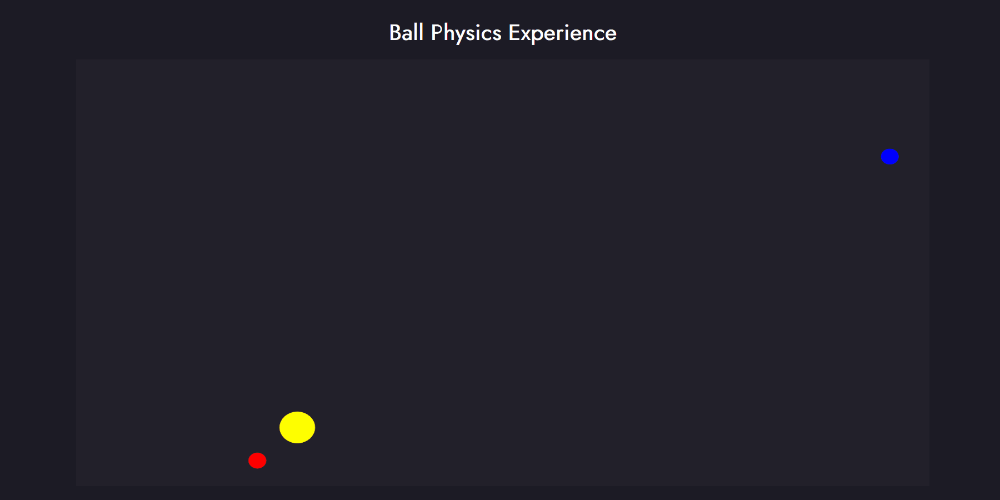

# Ball Physics Experiment :volleyball:

This is an attempt to recreate the physics of bouncing balls:basketball: using [TypeScript](https://github.com/microsoft/TypeScript) coupled with [Victor JS](https://github.com/maxkueng/victor), a library used for vector 	:arrow_right: manipulation. 

Try a live version [here](https://liberontissauri.github.io/Ball-Physics-With-TypeScript/)!

## Setup
Clone the Repo:
>git clone https://github.com/Liberontissauri/Ball-Physics-With-TypeScript

Install the dependencies:
>npm install

Run the project:
>npm start
